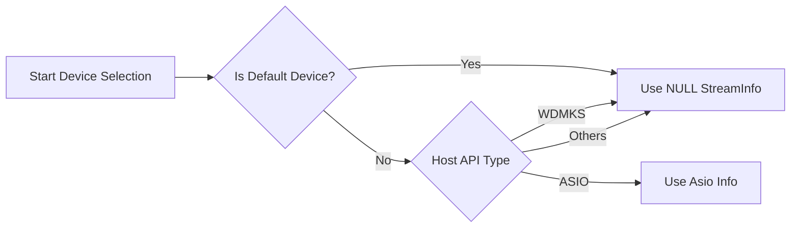

# Configuration and Tuning – Device and Host API Selection

This section explains how the application selects and configures audio devices and Host APIs via the `SPIAudioDevice` class. You will learn which variables control device choice, how ASIO-specific settings are applied, and how to tune these at build-time or run-time.

## Overview

The `SPIAudioDevice` component centralizes PortAudio device setup. It allows you to:

- **Choose** specific input/output devices by name.
- **Restrict** selection to a Host API (e.g. ASIO, WDM-KS).
- **Select** ASIO channels for multi-channel devices.
- **Apply** ASIO stream info when `PA_USE_ASIO=1`.

All logic lives in `SelectAudioInputDevice()` and `SelectAudioOutputDevice()` methods of `SPIAudioDevice` .

## Key Configuration Variables

Below is a summary of the main members in `SPIAudioDevice` used for device and Host API selection :

| Variable | Type | Purpose |
| --- | --- | --- |
| **global_audioinputdevicename** | `std::string` | Exact name of PortAudio input device to use. |
| **global_audiooutputdevicename** | `std::string` | Exact name of PortAudio output device to use. |
| 🎛️ **global_audioinputhostapi** | `std::string` | Host API for input (e.g. "ASIO", "Windows WDM-KS"). |
| 🎛️ **global_audiooutputhostapi** | `std::string` | Host API for output (e.g. "ASIO", "Windows DirectSound"). |
| **global_inputAudioChannelSelectors[2]** | `int[2]` | ASIO channel selectors for input (left/right). |
| **global_outputAudioChannelSelectors[2]** | `int[2]` | ASIO channel selectors for output (left/right). |
| **global_asioInputInfo** | `PaAsioStreamInfo` | ASIO-specific stream info for input. |
| **global_asioOutputInfo** | `PaAsioStreamInfo` | ASIO-specific stream info for output. |


## Initializing ASIO Stream Info

When building with `PA_USE_ASIO=1`, the code populates `PaAsioStreamInfo` structs to enable channel selectors :

```cpp
// Set up ASIO config for output
global_asioOutputInfo.size           = sizeof(PaAsioStreamInfo);
global_asioOutputInfo.hostApiType    = paASIO;
global_asioOutputInfo.version        = 1;
global_asioOutputInfo.flags          = paAsioUseChannelSelectors;
global_asioOutputInfo.channelSelectors = global_outputAudioChannelSelectors;
```

A similar block configures `global_asioInputInfo` using `global_inputAudioChannelSelectors`.

## Device Selection Logic

The selection workflow in `SelectAudioOutputDevice()` (and similarly for input) follows three steps:

1. **Build a map** of all PortAudio devices by name.
2. **Parse** the `global_audiooutputdevicename` for an optional Host API prefix (split on `":"`).
3. **Choose** the device ID and set up `global_outputParameters`.

A simplified flowchart:



### Detailed Steps

1. **Default Device**

If the selected name is empty or matches the default, the PortAudio default device is used and

`hostApiSpecificStreamInfo = NULL` .

1. **ASIO Devices**

For ASIO devices, the Host API type equals `paASIO`. The code then points

`global_outputParameters.hostApiSpecificStreamInfo` to `&global_asioOutputInfo`, enabling channel selector flags .

1. **WDM-KS and Others**

For WDM-KS (`paWDMKS`) or any other Host API, the stream info is set to `NULL`, as ASIO-specific settings are not applied .

## Tuning via Command-Line Parameters

Users can override defaults without code changes by supplying positional arguments:

```cpp
// Example in main():
if (nArgs > 3) {
    mySPIAudioDevice.global_audioinputdevicename = szArgList[3];
}
if (nArgs > 4) {
    mySPIAudioDevice.global_inputAudioChannelSelectors[0] = atoi(szArgList[4]);
}
if (nArgs > 5) {
    mySPIAudioDevice.global_inputAudioChannelSelectors[1] = atoi(szArgList[5]);
}
if (nArgs > 6) {
    mySPIAudioDevice.global_audiooutputdevicename = szArgList[6];
}
if (nArgs > 7) {
    mySPIAudioDevice.global_outputAudioChannelSelectors[0] = atoi(szArgList[7]);
}
if (nArgs > 8) {
    mySPIAudioDevice.global_outputAudioChannelSelectors[1] = atoi(szArgList[8]);
}
```

This allows dynamic selection of:

- **Input device name**
- **Input ASIO channels**
- **Output device name**
- **Output ASIO channels** .

## Build-Time Configuration

In the Visual Studio project file, ensure ASIO support is enabled:

```xml
<PreprocessorDefinitions>
  WIN32;PA_USE_ASIO=1;NDEBUG;_WINDOWS;_CRT_SECURE_NO_WARNINGS;%(PreprocessorDefinitions)
</PreprocessorDefinitions>
```

This define (`PA_USE_ASIO=1`) makes `PaAsioStreamInfo` available and used in device selection .

---

By mastering these settings, you can tailor which audio hardware and channels the application uses, whether you need low-latency ASIO or standard WDM-KS playback.