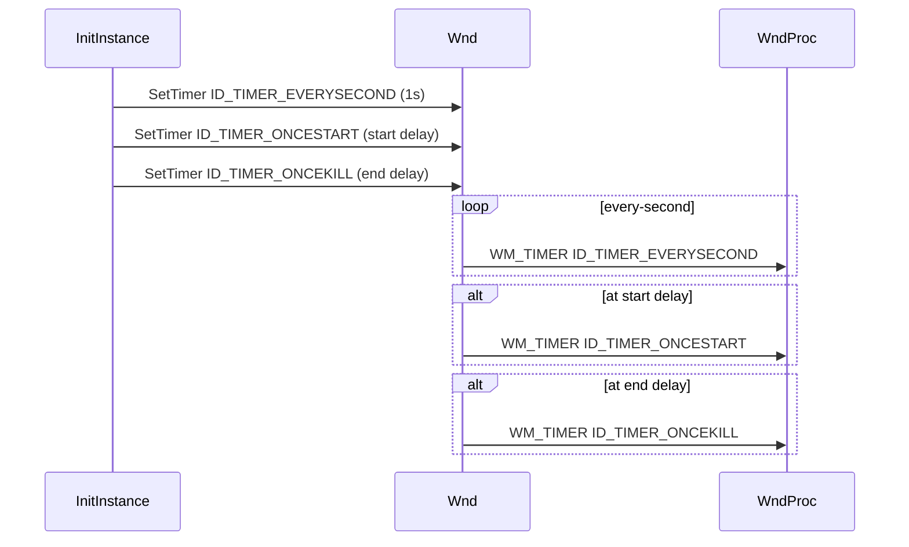

# Configuration and Tuning – Overlay Appearance and Behavior

This section describes how to customize the on-screen overlay’s look and behavior. All settings reside in **spitext.cpp**; adjust the variables below to fine-tune fonts, opacity, positioning, scripting hooks, and timer logic.

## Font Configuration

Control the base font used to draw overlay text. If **global_fontwidth** is set to `-1`, its width is auto-computed during painting.

| Variable | Description | Default |
| --- | --- | --- |
| **global_fontface** | Font family for drawing text | `"Arial"` |
| **global_fontheight** | Base font height in pixels | `480` |
| **global_fontwidth** | Base font width in pixels; auto-computed if set to `-1` | `-1` |


```cpp
// spitext.cpp
string global_fontface = "Arial";      // base font family
int    global_fontheight = 480;        // initial font height (px)
int    global_fontwidth  = -1;         // auto-compute if negative
```

## Opacity and Transparency

Adjust overlay blending and keying to make it semi-transparent or invisible except for text.

- **global_alpha**: opacity level (0–255) applied via `SetLayeredWindowAttributes`.
- **global_keyingcolor**: transparent “color key” (default magenta) used for chroma keying.

```cpp
BYTE    global_alpha       = 220;                     // overlay opacity
COLORREF global_keyingcolor = RGB(255, 0, 255);      // color to key out
...
SetLayeredWindowAttributes(
    hWnd,
    global_keyingcolor,
    (BYTE)global_alpha,
    LWA_COLORKEY | LWA_ALPHA
);
```

## Text Content and Modes

Define what the overlay displays. In **text mode**, **global_spitextstring** is shown literally; in **counter modes**, it’s overridden by formatted time.

- **global_spitextstring**: user-specified text or mode keywords (e.g. `"COUNTUP"`, `"CLOCK"`).

```cpp
// initial text to display in text mode
string global_spitextstring = "some text";
```

## Positioning Frame of Reference

These variables determine how **global_x**/**global_y** are interpreted when positioning the overlay:

- **global_monitor**: monitor index or grid (e.g. `"1"`, `"2.1"`) for relative coordinates.
- **global_hmonitor**: HMONITOR handle string (e.g. `"0x00001E76"`).
- **global_hwnd**: target window handle string for relative placement.
- **global_windowclass**: window class name for lookup.
- **global_windowtitle**: window title for lookup.

```bash
# Example: display at 50×50 relative to monitor 2
--monitor "2" --x 50 --y 50
```

## Automation Hooks

Run external scripts at key overlay events. Leave empty (`""`) to disable.

| Hook | Description | Default |
| --- | --- | --- |
| **global_begin** | Script before overlay appears | `""` |
| **global_starting** | Script exactly at overlay start | `""` |
| **global_finishing** | Script exactly before overlay end | `""` |
| **global_end** | Script after overlay closes | `""` |


```cpp
string global_begin     = "";
string global_starting  = "";
string global_finishing = "";
string global_end       = "";
```

## Timer Configuration ⏱️

Three timers control update cadence, delayed start, and delayed stop. You can tweak intervals or disable timers by commenting out `SetTimer` calls.

| Timer | Purpose | Setup Location |
| --- | --- | --- |
| **ID_TIMER_EVERYSECOND** | Fires every second for counter or clock updates | `InitInstance()` |
| **ID_TIMER_ONCESTART** | One-time delay before showing overlay | `InitInstance()` |
| **ID_TIMER_ONCEKILL** | One-time delay before destroying overlay | `InitInstance()` |


```cpp
// spitext.cpp : InitInstance
if (global_textmode > -1)
    SetTimer(hWnd, ID_TIMER_EVERYSECOND, 1000, NULL);
if (global_starttime_sec > 0)
    SetTimer(hWnd, ID_TIMER_ONCESTART, global_starttime_sec * 1000, NULL);
if (global_endtime_sec > 0)
    SetTimer(hWnd, ID_TIMER_ONCEKILL, global_endtime_sec * 1000, NULL);
```

### Timer Flow



With these settings, you can easily customize how your overlay looks, where it appears, when it shows or hides, and hook into those events for automation. Adjust values in **spitext.cpp**, rebuild in Visual Studio, and rerun your application to see changes immediately.