# Getting Started – Overview and Capabilities

This section introduces the core features and workflow of the Windows desktop application that records stereo audio to a WAV file. It highlights the major components, capabilities, and typical usage pattern.

## 🎯 Overview

- **Real-time stereo capture**: Uses PortAudio to capture two channels of audio at up to 48 kHz.
- **WAV encoding**: Streams captured audio through libsndfile into a standard WAV file.
- **Non-blocking I/O**: Employs a ring buffer and a dedicated writer thread so disk writes never interrupt audio callbacks.
- **Device flexibility**: Supports ASIO and WDMKS backends; users select input/output devices by exact name.
- **User controls**: Press **P** to pause or resume recording; optional live monitoring routes input to output.
- **On-screen overlay**: A Win32 text overlay can display elapsed time, countdown, or custom text over the desktop.

## 🚀 Key Capabilities

| Component | Purpose | Key Classes / Functions |
| --- | --- | --- |
| Audio Device I/O | Enumerate and select ASIO/WDMKS devices | **SPIAudioDevice** class |
| Real-time Capture | PortAudio callback writes samples to ring buffer | **recordCallback** |
| Ring Buffer | Buffer hundreds of milliseconds of audio data | **PaUtilRingBuffer**, `paTestData.ringBuffer` |
| WAV Writer Thread | Reads from ring buffer and appends to WAV via libsndfile | **threadFunctionWriteToWavFile**, **AppendWavFile** |
| Pause / Resume | Toggle recording without losing sync | `global_pauserecording`, WM_KEYDOWN → ‘P’ |
| Live Monitoring | Copy input to output stream even when paused | In-callback `memcpy(out, in, …)` |
| Overlay Display | Draw timers or counters on desktop window | WM_PAINT handler, `global_timetodisplay_sec` |


## ⚙️ Typical Usage

1. **Build** the Visual Studio solution `spirecordtodisk_ringbufferpausewin32.sln`.
2. **Run** the generated EXE with optional arguments to configure recording:

```bash
   spirecordtodisk_ringbufferpausewin32.exe \
     output.wav       # WAV filename (default: testrecording.wav) \
     30               # Duration in seconds (negative for unlimited) \
     "E-MU ASIO"      # Input device name \
     0 1              # Input ASIO channel selectors (left, right) \
     "Speakers (…)"   # Output device name (empty disables) \
     0 1              # Output channel selectors (left, right) \
     PAUSEONSTART     # Optional: start paused
```

1. **Press P** while running to pause or resume recording at any time.
2. **Close** the console window or press **Ctrl+C** to finalize the WAV file.

| Argument | Description | Default |
| --- | --- | --- |
| `<filename>` | Output WAV file path | testrecording.wav |
| `<duration>` | Recording time in seconds; negative = unlimited | 60 |
| `<inputDevice>` | Exact PortAudio device name for capture | Default system input |
| `<inCh0>` , `<inCh1>` | ASIO channel indices for left/right | 0 , 1 |
| `<outputDevice>` | Exact PortAudio device name for monitoring output | (none) |
| `<outCh0>` , `<outCh1>` | ASIO channel indices for output left/right | 0 , 1 |
| `PAUSEONSTART` | If set, recording begins in paused state | (off) |


## 🏗️ Architecture Diagram

```mermaid
flowchart LR
  A[Audio Input Device] --> B[PortAudio Stream]
  B --> C[recordCallback<br/>write to ring buffer]
  C --> D[PaUtilRingBuffer<br/>in paTestData]
  D --> E[Writer Thread<br/>threadFunctionWriteToWavFile]
  E --> F[AppendWavFile<br/>libsndfile → WAV File]
  subgraph Overlay
    G[Win32 Text Overlay] -->|Timer/Counters| H[Desktop Canvas]
  end
  B -->|Callbacks| G
```



This flowchart illustrates how audio flows from the selected device through PortAudio into a ring buffer, then onto disk, with an optional overlay component tapping into the stream for on-screen display.

---

With these building blocks and usage guidelines, you’ll be ready to start recording high-quality stereo WAV files with pause, monitoring, and on-screen feedback.