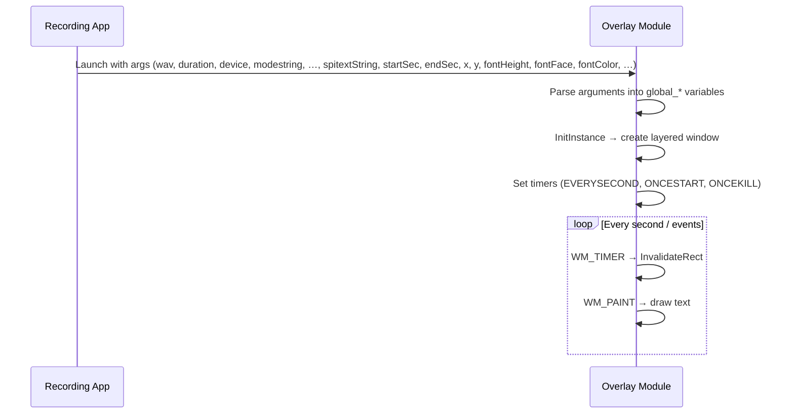

# On-Screen Text and Timer Overlay (spitext) – Integration with Recording and Scripting Hooks

This section describes the **spitext** overlay module, which renders on-screen text or a timer during a recording session. Although implemented as a standalone window, it conceptually integrates with the recorder by displaying elapsed, remaining, or custom text and exposing scripting hooks at key phases.

---

## Purpose

spitext provides a transparent, topmost window that:

- Renders text or a live counter (count-up, count-down, clock).
- Fires optional scripts/commands at phases: **begin**, **starting**, **finishing**, **end**.
- Supports dynamic pause/unpause via keyboard when enabled.

It augments the recording UX by visually tracking time and triggering external actions.

---

## Integration with the Recording Module ⏱️

The recorder (`spirecordtodisk_ringbufferpausewin32`) launches `spitext.exe` alongside audio capture, passing command-line arguments. These configure start/end times, display modes, position, styling, and scripting hooks.



---

## Configuration Variables 🔧

The following globals control styling and scripting. Defaults are defined in `spitext.h` , and can be overridden via command-line.

| Variable | Default | Description |
| --- | --- | --- |
| **global_fontface** | `"Arial"` | Font family used for rendering text. |
| **global_idfontcolor** | `0` | Index into a predefined RGB palette for text color. |
| **global_begin** | `""` | Command/script to execute **before** the overlay starts. |
| **global_starting** | `""` | Command/script to execute **when** the overlay becomes visible. |
| **global_finishing** | `""` | Command/script to execute **when** the timer/countdown reaches its end. |
| **global_end** | `""` | Command/script to execute **after** the overlay window is destroyed. |
| **global_pausedisabled** | `false` | Disables pause/unpause keyboard handling when `true`. A passive display only. |


---

## Argument Parsing & Scripting Hooks 📝

`spitext.cpp` reads extra parameters after the standard audio args. The scripting hooks are captured here:

```cpp
// In _tWinMain after global_endtime_sec, global_alpha, …
if (nArgs > (11 + nargs_recordtodisk)) {
    global_begin    = szArgList[11 + nargs_recordtodisk];
}
if (nArgs > (12 + nargs_recordtodisk)) {
    global_starting = szArgList[12 + nargs_recordtodisk];
}
if (nArgs > (13 + nargs_recordtodisk)) {
    global_finishing= szArgList[13 + nargs_recordtodisk];
}
if (nArgs > (14 + nargs_recordtodisk)) {
    global_end      = szArgList[14 + nargs_recordtodisk];
}
```

Each non-empty string triggers a `ShellExecuteA` call at the corresponding phase .

---

## Styling Overrides 🔤

Users can override the font face and color index via arguments:

```cpp
if (nArgs > (7 + nargs_recordtodisk)) {
    global_fontface   = szArgList[7 + nargs_recordtodisk];
}
if (nArgs > (8 + nargs_recordtodisk)) {
    global_idfontcolor= atoi(szArgList[8 + nargs_recordtodisk]);
}
```

These values replace the defaults (`"Arial"`, `0`) .

---

## Window Activation & Keyboard Hooks 🎹

By default, the overlay window is **non-activatable** (no taskbar icon, no focus) to act as a passive display. When **global_pausedisabled** is `false`, the window is created to accept keyboard events (e.g., `P` key for pause/unpause).

### Window Styles in InitInstance

```cpp
DWORD Flags1 = WS_EX_COMPOSITED | WS_EX_LAYERED | WS_EX_NOACTIVATE | WS_EX_TOPMOST | WS_EX_TRANSPARENT;
// Allow activation (taskbar icon) and keyboard input when pause is enabled
if (!global_pausedisabled) {
    Flags1 = WS_EX_COMPOSITED | WS_EX_LAYERED | WS_EX_TOPMOST | WS_EX_TRANSPARENT;
}
CreateWindowEx(Flags1, …);
```

This toggle enables or removes `WS_EX_NOACTIVATE` based on **global_pausedisabled** .

### Positioning Without Taskbar Icon

In the `WM_PAINT` handler, `SetWindowPos` is called with different flags:

```cpp
if (global_pausedisabled) {
    // No icon; passive overlay
    SetWindowPos(hWnd, NULL, global_x, global_y, w, h, SWP_NOZORDER);
} else {
    // Show icon; accept P key
    SetWindowPos(hWnd, NULL, global_x, global_y, w, h, SWP_SHOWWINDOW);
}
```

This switch ensures proper interactivity .

---

## Color Palette

The `global_idfontcolor` index selects from a simple palette in `DrawTextXOR`:

```cpp
if (global_idfontcolor==0) crOldTextColor_memhdc = SetTextColor(..., RGB(255,0,255));  // white
else if (global_idfontcolor==1) crOldTextColor_memhdc = SetTextColor(..., RGB(0,255,255)); // blue
// … up to index 6
```

---

## Summary

spitext seamlessly integrates with the audio recorder to:

- Display **custom text** or **live timers**.
- Expose **scripting hooks** at start/end phases.
- Dynamically handle **pause/unpause** when enabled.
- Offer **styling** via font face and color index overrides.

By tuning the **global_*** variables, users can tailor on-screen feedback and automate external actions during recording sessions.