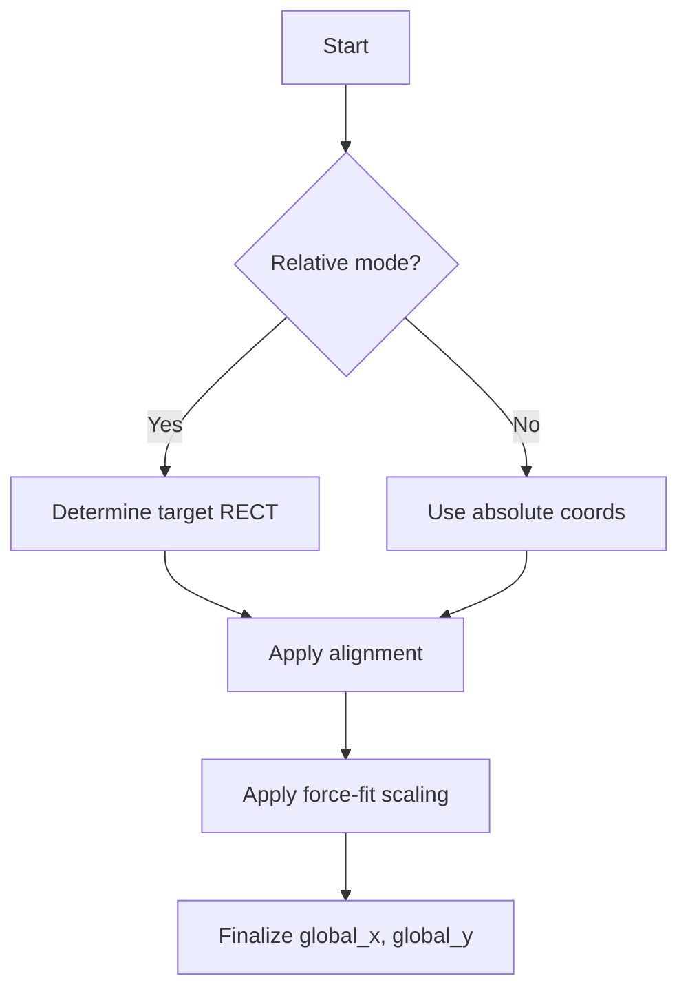

# On-Screen Text and Timer Overlay (spitext) – Positioning and Layout Options

This section explains how the **spitext** module determines where and how to draw on-screen text and timer overlays. It covers coordinate modes, monitor and window referencing, alignment, scaling options, and helper classes that gather screen and window information.

## Coordinate Reference: Absolute vs. Relative

Text placement uses either absolute screen coordinates or coordinates relative to a target rectangle.

- **Absolute**: `global_xyabsolute == true`

Coordinates (`global_x`, `global_y`) refer to the combined monitor surface or individual monitors when multimonitor mode is disabled .

- **Relative**: `global_xyabsolute == false`

Coordinates are offsets within a target `RECT` (monitor sub-region or window rectangle) .

## 🖥️ Monitor-Based Positioning

Monitor parameters let you position text relative to specific screens or sub-regions.

| **Parameter** | **Description** | **Examples** |
| --- | --- | --- |
| `global_monitor` | Select monitor or sub-region. Uses “.” for 4 quarters, “:” for 16 sub-regions. | `"1"`, `"2.1"`, `"1:16"` |
| `global_hmonitor` | HMONITOR handle as string. Overrides `global_monitor`. | `"0x00001E76"` |
| `global_fullmonitorssurface` | When `1` (default), absolute coords span all monitors; `0` limits to one monitor. | `1` (allow), `0` (restrict) |


## 🪟 Window-Based Positioning

These options anchor the overlay to a specific window’s client rectangle.

| **Parameter** | **Behavior** |
| --- | --- |
| `global_hwnd` | HWND handle as string. Uses `FindWindowA` + `GetWindowRect` to set target `RECT`. |
| `global_windowclass` | Window class name. Searches top-level windows via `EnumWindows` . |
| `global_windowtitle` | Window title text. Similar search via `EnumWindows` . |


## Alignment and Justification

After computing the target rectangle, you can align text within it.

- **Horizontal**: `global_horizontaljustification` accepts `"left"`, `"center"`, `"right"`.
- **Vertical**: `global_verticaljustification` accepts `"top"`, `"center"`, `"bottom"`.

The `justification(mySIZE)` function adjusts `(global_x, global_y)` based on the text size .

```cpp
if (!global_horizontaljustification.empty() || !global_verticaljustification.empty()) {
    justification(mySIZE);
}
```

## 🔧 Force-Fit Scaling

Force-fit options let you scale font size so text always fits the target region.

- `global_horizontalforcefit` and `global_verticalforcefit` range 0.0–1.0.
- Values > 0 specify the percentage of region width/height to occupy.
- The code computes new bounds and recalculates font height:

```cpp
int newmaxwidth  = maxwidth  * global_horizontalforcefit;
int newmaxheight = maxheight * global_verticalforcefit;
int newfontheight = newmaxwidth * global_fontheight / mySIZE.cx;
HFONT newhfont = CreateFontA(newfontheight, …, global_fontface.c_str());
```

## 🌐 Multi-Monitor Surface

Controlling monitor span:

- **Enabled** (`global_fullmonitorssurface = 1`):

Absolute coords can fall anywhere in the combined monitor rectangle.

- **Disabled** (`0`):

Absolute coords must lie within a single monitor’s `RECT` .

## Utility Classes: MonitorRects & EnumWindowsStruct_spitext

At startup, **spitext** builds data structures to support relative positioning:

- **MonitorRects**
- Gathers `rcMonitors[]` (each monitor) and `rcCombined` (all monitors).
- **EnumWindowsStruct_spitext**
- Collects top-level windows into maps by class and title.
- Uses `EnumWindows` → `EnumWindowsProc` for filtering .

Both structures populate globals `_monitors` and `_windows` automatically .

## Position Resolution Flowchart



## Example Configuration Snippet

Below is how command-line arguments set positioning globals in `_tWinMain`:

```cpp
if (nArgs > 16 + nargs_recordtodisk) {
    // e.g. "2.3" for quarter-screen, sub-region 3 of monitor 2
    global_monitor = szArgList[16 + nargs_recordtodisk];
}
```

fileciteℂturn1file6

---

This module provides flexible primitives for on-screen overlay placement, adapting to multi-monitor setups, window anchoring, alignment rules, and automatic scaling to ensure clear, consistent rendering across varied display environments.