# On-Screen Text and Timer Overlay (spitext) – Text Modes, Counters, and Timing

This section describes how the application overlays text and timers on screen. It covers text modes, counter formats, display timing, window transparency, timer setup, and rendering logic. Together, these features enable customizable on-screen displays such as count-up, count-down, or wall-clock overlays during audio recording.

## Text Modes 🎯

The overlay supports two primary modes: plain text and counters.

- **global_textmode** selects the display behavior.

| Value | Mode | Description |
| --- | --- | --- |
| -1 | Plain Text | Renders `global_spitextstring` verbatim. |
| 0 | COUNTUP (global_countermodeCOUNTUP) | Displays elapsed time since start. |
| 1 | COUNTDOWN (global_countermodeCOUNTDOWN) | Displays remaining time until end. |
| 2 | CLOCK (global_countermodeCLOCK) | Displays the current local time. |


Values 0–2 are mapped from the strings `"COUNTUP"`, `"COUNTDOWN"`, or `"CLOCK"` found in `global_spitextstring` during initialization .

## Counter Formats ⏱

When in a counter mode, you control the time format via **global_textformat**, selecting how hours, minutes, and seconds appear.

| Index | Format | Pattern |
| --- | --- | --- |
| -1 | Raw Text | `as-is` |
| 0 | HH:MM:SS (global_counterformatHHMMSS) | `%02d.%02d:%02d` |
| 1 | HH:MM   (global_counterformatHHMM) | `%02d.%02d` |
| 2 | MM:SS   (global_counterformatMMSS) | `%02d:%02d` |
| 3 | HH      (global_counterformatHH) | `%02d` |
| 4 | MM      (global_counterformatMM) | `%02d` |
| 5 | SS      (global_counterformatSS) | `%02d` |


The default when entering a counter mode is `HH:MM:SS` unless a different substring (e.g. `"MM:SS"`) appears in `global_spitextstring` .

## Timing Configuration ⏳

You can delay the start and automatically end the overlay using:

- **global_starttime_sec** (≥0): Seconds to wait before **beginning** the overlay.
- **global_endtime_sec** (≥0): Seconds after app start when the overlay **stops**.
- **global_timetodisplay_sec**: Internally calculated; represents the time value shown in counter modes.

If only `global_spitextstring` (non-counter) is used, these control simple delay and kill timers .

## Window Opacity & Transparency 🌫️

The overlay window uses layered attributes to blend text over other applications:

- **global_keyingcolor**: A chroma-key color (default `RGB(255,0,255)`).
- **global_alpha** (0–255): Opacity level.

In `InitInstance()`, after creating the window, attributes are set as follows:

```cpp
SetLayeredWindowAttributes(
    hWnd,
    global_keyingcolor,
    (BYTE)global_alpha,
    LWA_COLORKEY | LWA_ALPHA
);
```

This call enables both color-key transparency and per-pixel alpha blending .

## Timer Setup ⏲️

Three Win32 timers govern overlay behavior. In `InitInstance()`, after sizing the window to fit text:

```cpp
// Counter updates every second
if(global_textmode > -1) {
    SetTimer(hWnd, ID_TIMER_EVERYSECOND, 1000, NULL);
}

// Start plain text overlay after delay
if(global_textmode < 0 && global_starttime_sec > 0) {
    SetTimer(hWnd, ID_TIMER_ONCESTART, global_starttime_sec * 1000, NULL);
}

// Stop overlay at end time
if(global_textmode < 0 && global_endtime_sec > 0) {
    SetTimer(hWnd, ID_TIMER_ONCEKILL, global_endtime_sec * 1000, NULL);
}
```

Each timer ID has a specific role:

- **ID_TIMER_EVERYSECOND**: Triggers every second to update displays .
- **ID_TIMER_ONCESTART**: Fires once to begin plain text rendering.
- **ID_TIMER_ONCEKILL**: Fires once to tear down the overlay.

## Timer Handling in WndProc

Within the `WM_TIMER` handler, timers execute three main tasks:

1. **Start Condition**

On `ID_TIMER_ONCESTART`, invalidate the window and kill the start timer.

1. **End Condition**

On `ID_TIMER_ONCEKILL`, optionally launch a finish action (e.g. run a script), destroy the timer, and post `WM_DESTROY`.

1. **Counting Modes**
2. **COUNTUP & CLOCK**: Compute elapsed seconds, adjust for pause time, derive `global_timetodisplay_sec`, and invalidate for repaint.
3. **COUNTDOWN**: Compute remaining time similarly.
4. **Plain Text**: Only redraw on start/kill events .

## Text Rendering Logic

The overlay uses XOR blitting to erase and redraw text without flicker. In `WM_PAINT`:

1. **Determine Content**
2. : Show `global_spitextstring` or blank until start delay lapses.
3. : Fetch local time (`CLOCK`) or compute `hh, mm, ss` from `global_timetodisplay_sec`.
4. **Format String**

Selects a `printf` format based on `global_textformat`:

```cpp
   if(global_textformat == global_counterformatMMSS)
       sprintf(charbuffer, "%02d:%02d", mm, ss);
   // ... other formats
```

1. **Draw via XOR**

Previous text erased and new text drawn:

```cpp
   DrawTextXOR(hdc, oldBuffer, oldLen);
   DrawTextXOR(hdc, charbuffer, newLen);
```

This uses a compatible DC, bitmap, and `BitBlt` with raster operation `0x00990066` to implement XOR mode .

## Integration Flow

```mermaid
flowchart TD
    A[Application Start] --> B[Parse Command‐Line for spitext args]
    B --> C[Set global_textmode & global_textformat]
    C --> D[InitInstance: Create Layered Window\n& SetTimers]
    D --> E[WndProc: WM_TIMER Updates\nglobal_timetodisplay_sec]
    E --> F[WndProc: WM_PAINT Draw Text with XOR]
    F --> G[Overlay Visible until endtime]
```



This flow ensures the text overlay starts, updates, and ends according to user parameters and recording lifecycle.