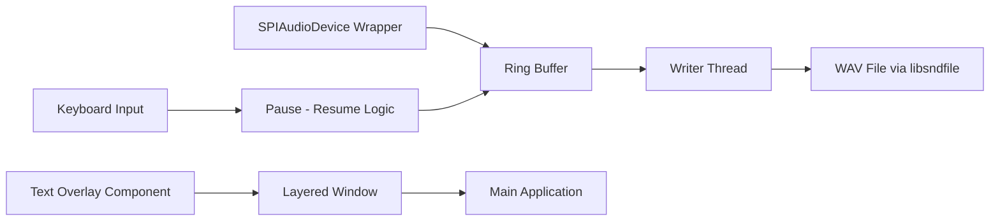

# Project Structure and Build Details

## Source Layout

The Visual Studio solution is organized into logical units. Each unit corresponds to a set of source files that implement a specific feature or subsystem. This structure ensures clear separation of concerns and simplifies maintenance.

| File / Folder | Purpose |
| --- | --- |
| **spirecordtodisk_ringbufferpausewin32.cpp** | Main entry point; initializes audio, ring buffer, threads, overlay, pause logic, and CLI. |
| **spirecordtodisk_ringbufferpausewin32.h** | Core data types, constants, thread prototypes, and `Terminate()` API. |
| **spiaudiodevice.h / spiaudiodevice.cpp** | Wrapper around PortAudio for device selection, host API detection, and ASIO channel setup. |
| **spitext.h / spitext.cpp** | Transparent layered window for on-screen timer/counter and text overlay. |
| **spiutility.h / spiutility.cpp** | Shared helpers for timing, command-line parsing, and general utilities. |
| **stdafx.h / stdafx.cpp**, **targetver.h** | Precompiled header and Windows target version configuration for faster build times. |
| **audio_spi.rc** | Resource script defining icons, dialogs, and menu resources used by the UI components. |
| **small.pxf** | Pixelformer project file for icon and bitmap resources referenced by the resource script. |
| **spi.licenseheader** | GPL license header snippet automatically prepended to each source file. |
| **lib-src/portaudio/src/common/pa_ringbuffer.c** | PortAudio ring buffer implementation compiled directly into the project. |
| **lib-src/portaudio/src/os/win/pa_win_util.c** | Windows utility functions for PortAudio, including critical Win32 helpers. |


---

## Main Application Module

Contains the core logic for recording, pausing, and displaying status.

### spirecordtodisk_ringbufferpausewin32.cpp

- **Entry point**: `WinMain` sets up the application.
- **Initialization**:
- Configures PortAudio via `SPIAudioDevice`.
- Allocates and initializes the ring buffer.
- Starts the writer thread to consume samples and write to WAV.
- **Pause/Resume**: Monitors keyboard events to toggle recording.
- **Overlay Wiring**: Instantiates the text overlay when requested.
- **Termination**: Hooks global events and calls `Terminate()`.

```cpp
int APIENTRY WinMain(HINSTANCE hInstance, HINSTANCE, LPSTR lpCmdLine, int nCmdShow)
{
    // Initialize PortAudio, ring buffer, threads, and overlay
    // Parse command-line options
    // Enter message loop until termination
}
```

### spirecordtodisk_ringbufferpausewin32.h

- **paTestData**: Holds buffer pointers, state flags, and sample counters.
- **Ring buffer constants**: Defines buffer size and sample rates.
- **Thread prototypes**:

```cpp
  DWORD WINAPI WriterThreadProc(LPVOID lpParam);
```

- **API Declaration**:

```cpp
  void Terminate();
```

---

## Audio Device Helper

Encapsulates PortAudio host API and device management.

### spiaudiodevice.h / spiaudiodevice.cpp

- **Class**: `SPIAudioDevice`
- **Responsibilities**:
- Enumerate input devices across host APIs.
- Auto-select default or ASIO device if available.
- Configure channel count, sample format, and latency.
- **Key Methods**:

```cpp
  bool Initialize(int sampleRate, int channels);
  PaStream* OpenStream();
  void CloseStream();
```

---

## On-Screen Text Overlay

Manages real-time display of timers and status text.

### spitext.h / spitext.cpp

- **Component**: `SPITextOverlay`
- **Features**:
- Creates a transparent, click-through layered window.
- Renders elapsed time, sample count, or custom text.
- Uses Win32 timers for periodic redraws.
- Integrates with monitor enumeration for multi-display setups.

```cpp
class SPITextOverlay {
public:
    bool Create(HWND hwndParent);
    void UpdateText(const std::wstring& text);
    void Destroy();
};
```

---

## Shared Utilities

General helper functions used across modules.

### spiutility.h / spiutility.cpp

- **Timing**: High-resolution timers and sleep helpers.
- **Parsing**: Command-line argument parsing and validation.
- **Logging**: Simple debug and error output routines.

```cpp
uint64_t GetHighResTime();
bool ParseArguments(int argc, char* argv[], Config& cfg);
```

---

## Precompiled Headers & Target Configuration

Speeds up build times and ensures consistent Windows version support.

### stdafx.h / stdafx.cpp

- Standard system and project headers consolidated.

### targetver.h

- Defines `_WIN32_WINNT` and related macros to target a specific Windows version.

---

## Resources

Defines icons, menus, and UI elements for the desktop application.

### audio_spi.rc

- **Icons**: Application and tray icons.
- **Dialogs**: Pause notification and about boxes.
- **Menus**: Basic command menu for start, stop, pause, and exit.

### small.pxf

- XML-based Pixelformer file listing bitmaps and cursors referenced by `audio_spi.rc`.

---

## Bundled PortAudio Support

Includes select PortAudio sources to avoid external dependencies.

### lib-src/portaudio/src/common/pa_ringbuffer.c

- High-performance lock-free ring buffer implementation.

### lib-src/portaudio/src/os/win/pa_win_util.c

- Win32 threading and synchronization helpers used by PortAudio.

---

## License Header Snippet

### spi.licenseheader

A GPL header that is prepended to every source file to ensure compliance with the project license.

```text
/*  
 * spirecordtodisk_ringbufferpausewin32  
 *  
 * Copyright (C) 2026 oifii  
 * Licensed under the GNU General Public License v3  
 */
```

---

## Recording Pipeline Overview 🔄

The following diagram illustrates the data and control flow between core components.



- **AudioDevice → RingBuffer**: Captures PCM samples.
- **RingBuffer → WriterThread**: Buffers data for async file writing.
- **WriterThread → WAVFile**: Commits data to disk via libsndfile.
- **Keyboard → PauseLogic → RingBuffer**: Toggles read/write operations.
- **TextOverlay → Layered Window**: Renders UI overlay on top of the desktop.