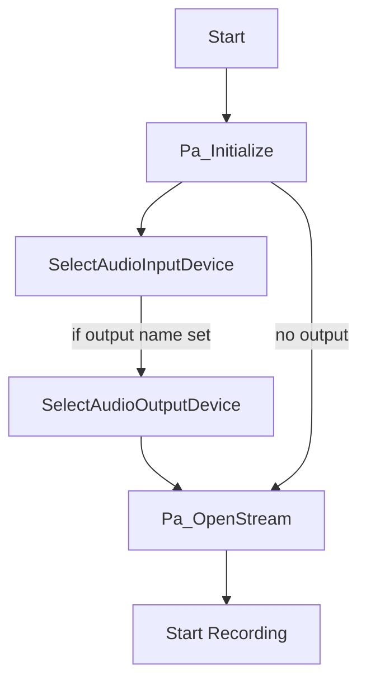

# Using the Recorder Application – Choosing and Configuring Audio Devices 🎛️

This section explains how the recorder selects and configures audio I/O devices using the `SPIAudioDevice` abstraction. You’ll learn how device names, channel selectors, and host-API settings are applied before opening the PortAudio stream.

## SPIAudioDevice Class

The `SPIAudioDevice` class centralizes audio‐device configuration and state. It exposes maps, parameters, and ASIO-specific structures.

| Member | Type | Purpose |
| --- | --- | --- |
| `global_inputdevicemap` | `std::map<string,int>` | Maps input‐device name → PortAudio device index |
| `global_outputdevicemap` | `std::map<string,int>` | Maps output‐device name → PortAudio device index |
| `global_audioinputdevicename` | `std::string` | User-specified input device name (from CLI) |
| `global_audiooutputdevicename` | `std::string` | User-specified output device name (from CLI) |
| `global_inputAudioChannelSelectors[2]` | `int[2]` | ASIO input channel selectors (left/right) |
| `global_outputAudioChannelSelectors[2]` | `int[2]` | ASIO output channel selectors (left/right) |
| `global_inputParameters` | `PaStreamParameters` | PortAudio input parameters |
| `global_outputParameters` | `PaStreamParameters` | PortAudio output parameters |
| `global_asioInputInfo`, `global_asioOutputInfo` | `PaAsioStreamInfo` | ASIO stream info, including channel selectors and flags |


## Configuring Device Names and Channels

Before initializing PortAudio, the application reads CLI arguments to set device names and channel selectors. For example:

```cpp
// Default ASIO patchmix device and channels
mySPIAudioDevice.global_audioinputdevicename = "E-MU ASIO";
mySPIAudioDevice.global_inputAudioChannelSelectors[0] = 0;  // left channel
mySPIAudioDevice.global_inputAudioChannelSelectors[1] = 1;  // right channel

// Optionally override via argv[]
if (nArgs > 3)
    mySPIAudioDevice.global_audioinputdevicename = szArgList[3];
if (nArgs > 4)
    mySPIAudioDevice.global_inputAudioChannelSelectors[0] = std::atoi(szArgList[4]);
if (nArgs > 5)
    mySPIAudioDevice.global_inputAudioChannelSelectors[1] = std::atoi(szArgList[5]);
```

## Selecting an Audio Input Device

`SPIAudioDevice::SelectAudioInputDevice()` builds the device map, matches the requested name (and optional host API), and configures `global_inputParameters`.

**Selection steps:**

- **Build map:** Query all devices and store name→index.
- **Parse host API:** If `global_audioinputdevicename` contains `":"`, split into `global_audioinputhostapi` and pure device name.
- **Find device index:**
- If name empty → use default.
- If name in map and no host API → use it.
- If host API specified → iterate devices to match both name & host-API.
- Fallback → default input device.
- **Populate parameters:**
- `device`, `channelCount`, `sampleFormat`, `suggestedLatency` from `Pa_GetDeviceInfo`.
- **ASIO config:**
- If selected device’s host API is ASIO → `hostApiSpecificStreamInfo = &global_asioInputInfo`.
- Else → `hostApiSpecificStreamInfo = NULL`.

```cpp
// After determining deviceid...
global_inputParameters.device = deviceid;
global_inputParameters.channelCount = NUM_CHANNELS;
global_inputParameters.sampleFormat = PA_SAMPLE_TYPE;
global_inputParameters.suggestedLatency =
    Pa_GetDeviceInfo(deviceid)->defaultLowInputLatency;

// ASIO-specific
global_asioInputInfo.size       = sizeof(PaAsioStreamInfo);
global_asioInputInfo.hostApiType= paASIO;
global_asioInputInfo.version    = 1;
global_asioInputInfo.flags      = paAsioUseChannelSelectors;
global_asioInputInfo.channelSelectors = global_inputAudioChannelSelectors;

if (Pa_GetHostApiInfo(Pa_GetDeviceInfo(deviceid)->hostApi)->type == paASIO)
    global_inputParameters.hostApiSpecificStreamInfo = &global_asioInputInfo;
else
    global_inputParameters.hostApiSpecificStreamInfo = NULL;
```

## Selecting an Audio Output Device

`SPIAudioDevice::SelectAudioOutputDevice()` mirrors the input logic for output. It populates `global_outputParameters` and applies ASIO channel selectors when appropriate.

```cpp
// After determining deviceid...
global_outputParameters.device       = deviceid;
global_outputParameters.channelCount = NUM_CHANNELS;
global_outputParameters.sampleFormat = PA_SAMPLE_TYPE;
global_outputParameters.suggestedLatency =
    Pa_GetDeviceInfo(deviceid)->defaultLowOutputLatency;

// ASIO-specific
global_asioOutputInfo.size       = sizeof(PaAsioStreamInfo);
global_asioOutputInfo.hostApiType= paASIO;
global_asioOutputInfo.version    = 1;
global_asioOutputInfo.flags      = paAsioUseChannelSelectors;
global_asioOutputInfo.channelSelectors = global_outputAudioChannelSelectors;

if (Pa_GetHostApiInfo(Pa_GetDeviceInfo(deviceid)->hostApi)->type == paASIO)
    global_outputParameters.hostApiSpecificStreamInfo = &global_asioOutputInfo;
else
    global_outputParameters.hostApiSpecificStreamInfo = NULL;
```

## Recorder Initialization Flow

Below is the high-level process for setting up PortAudio streams once devices are configured.



1. **Pa_Initialize**
2. **SelectAudioInputDevice** → fills `global_inputParameters`
3. **SelectAudioOutputDevice** (if `global_audiooutputdevicename` ≠ empty) → fills `global_outputParameters`
4. **Pa_OpenStream** with input/output parameters and callback
5. **Pa_StartStream** → begin recording/monitoring

## Best Practices

```card
{
    "title": "Device Name Matching",
    "content": "Always use the exact device name string as reported by spidevicesselect or PortAudio to avoid falling back to defaults."
}
```

- Use spidevicesselect to list exact names.
- Specify host API (e.g., `ASIO:E-MU ASIO`) when multiple devices share names.
- Validate channel selectors against `maxInputChannels` or `maxOutputChannels`.

With these configurations in place, the recorder will open the correct audio devices—ASIO or otherwise—and honor your channel‐selection preferences.