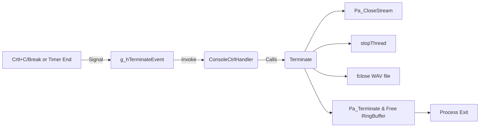

# Using the Recorder Application – Recording Lifecycle and Shutdown

This section walks through the end-to-end lifecycle of a recording session in the Spirecordtodisk application. You will learn how the app initializes audio resources, starts and manages recording, handles pause/resume, and performs a clean shutdown of all threads and PortAudio components.

## 1. Initialization 🎛️

Before audio data flows, the application sets up global state, allocates a ring buffer for sample caching, and opens the PortAudio stream.

- **Zero-initialize** `global_paTestData` to hold ring-buffer metadata, file handles, and thread state .
- **Allocate ~500 ms buffer**

```cpp
  unsigned numSamples = NextPowerOf2((unsigned)(SAMPLE_RATE * 0.5 * NUM_CHANNELS));
  unsigned numBytes   = numSamples * sizeof(SAMPLE);
  global_paTestData.ringBufferData = (SAMPLE*) PaUtil_AllocateMemory(numBytes);
```

- **Initialize ring buffer**

```cpp
  PaUtil_InitializeRingBuffer(
      &global_paTestData.ringBuffer,
      sizeof(SAMPLE),
      numSamples,
      global_paTestData.ringBufferData
  );
```

- **Initialize PortAudio**

```cpp
  Pa_Initialize();
```

- **Select audio devices** via `SPIAudioDevice` helper

```cpp
  mySPIAudioDevice.SelectAudioInputDevice();
  mySPIAudioDevice.SelectAudioOutputDevice();
```

- **Open full-duplex/input-only stream** with our `recordCallback`

```cpp
  Pa_OpenStream(
      &stream,
      &mySPIAudioDevice.global_inputParameters,
      p_outputParameters,
      SAMPLE_RATE,
      FRAMES_PER_BUFFER,
      paClipOff,
      recordCallback,
      &global_paTestData
  );
```

## 2. Start Recording ▶️

Once initialization succeeds, the app opens the output file, spawns a writer thread, and activates the PortAudio stream.

1. **Open WAV file**

```cpp
   global_paTestData.file = fopen(global_filename.c_str(), "wb");
```

1. **Launch writer thread**

```cpp
   startThread(&global_paTestData, threadFunctionWriteToWavFile);
```

- Under the hood, `_beginthreadex` creates a suspended thread, sets its priority above normal, then resumes it.
- The thread signals readiness via `threadSyncFlag` .
- **Start audio callback**

```cpp
   Pa_StartStream(stream);
```

1. **User feedback**

```cpp
   printf("=== Now recording to '%s' ... Press P to pause/unpause ===\n",
          global_filename.c_str());
```

## 3. Ongoing Recording 📝

Recording proceeds in two concurrent loops:

| Component | Responsibility |
| --- | --- |
| **recordCallback** | Runs in PortAudio’s audio thread; pulls samples from the input buffer and writes them into the ring buffer. |
| **Writer thread** | Continuously drains the ring buffer and appends interleaved samples to disk via libsndfile. |


### recordCallback

```cpp
int recordCallback(const void* inputBuffer, void* outputBuffer,
                   unsigned long framesPerBuffer,
                   const PaStreamCallbackTimeInfo* timeInfo,
                   PaStreamCallbackFlags statusFlags,
                   void* userData)
{
    paTestData* data = (paTestData*)userData;
    ring_buffer_size_t writable =
        PaUtil_GetRingBufferWriteAvailable(&data->ringBuffer);
    ring_buffer_size_t toWrite =
        min(writable, (ring_buffer_size_t)(framesPerBuffer * NUM_CHANNELS));

    data->frameIndex += PaUtil_WriteRingBuffer(
        &data->ringBuffer,
        (const SAMPLE*)inputBuffer,
        toWrite
    );
    return paContinue;
}
```

- Uses `PaUtil_GetRingBufferWriteAvailable` to avoid overflow.
- Always returns `paContinue` to keep the stream alive.

### threadFunctionWriteToWavFile

```cpp
int threadFunctionWriteToWavFile(void* ptr) {
    paTestData* pData = (paTestData*)ptr;
    pData->threadSyncFlag = 0;

    while (true) {
        ring_buffer_size_t available =
            PaUtil_GetRingBufferReadAvailable(&pData->ringBuffer);

        if (available >= pData->ringBuffer.bufferSize / NUM_WRITES_PER_BUFFER
            || pData->threadSyncFlag)
        {
            void* regions[2] = {0};
            ring_buffer_size_t sizes[2] = {0};

            ring_buffer_size_t readCount =
                PaUtil_GetRingBufferReadRegions(
                    &pData->ringBuffer,
                    available,
                    regions + 0, sizes + 0,
                    regions + 1, sizes + 1
                );

            if (readCount > 0) {
                for (int i = 0; i < 2 && regions[i] != NULL; ++i) {
                    AppendWavFile(
                        global_filename.c_str(),
                        regions[i],
                        pData->ringBuffer.elementSizeBytes,
                        sizes[i]
                    );
                }
                PaUtil_AdvanceRingBufferReadIndex(
                    &pData->ringBuffer, readCount
                );
            }

            if (pData->threadSyncFlag) break;
        }
        Pa_Sleep(20);
    }

    pData->threadSyncFlag = 0;
    return 0;
}
```

- Reads in chunks to minimize syscall overhead.
- Stops when `threadSyncFlag` is set by shutdown sequence.

## 4. Pause and Resume ⏸️⏯️

The **P** key toggles recording without stopping playback:

- **Flags**
- `global_pauserecording`: if `true`, `recordCallback` skips writing to disk.
- `global_prev_pauserecording`: used to mute output for one buffer after resuming.
- `global_pausestartstamp_ms` and `global_pausetimetotal_ms`: track paused duration.

- **Key handler** (in `WndProc` / console loop):

```cpp
  case WM_KEYDOWN:
    if (wParam == 0x50) { // 'P'
      if (!global_pauserecording) {
        global_pauserecording = true;
        global_pausestartstamp_ms = GetTickCount();
      } else {
        global_pauserecording = false;
        global_pausetimetotal_ms +=
          GetTickCount() - global_pausestartstamp_ms;
        global_pausestartstamp_ms = 0;
      }
    }
    break;
```

- **Callback behavior**:

When paused, `recordCallback` simply returns early, preserving playback continuity.

## 5. Termination 🔚

Graceful shutdown is triggered by time limits, user CTRL+C/CTRL+BREAK, or console close. A Windows event and console handler coordinate exit.



### ConsoleCtrlHandler

```cpp
BOOL WINAPI ConsoleCtrlHandler(DWORD dwCtrlType) {
    if (dwCtrlType == CTRL_C_EVENT ||
        dwCtrlType == CTRL_BREAK_EVENT ||
        dwCtrlType == CTRL_CLOSE_EVENT)
    {
        Terminate(NULL);
        SetEvent(g_hTerminateEvent);
        return TRUE;
    }
    return FALSE;
}
```

- Captures console signals and delegates to `Terminate()`.

### Terminate()

```cpp
int Terminate(FILE* pFILE = stderr) {
    PaError err = Pa_CloseStream(stream);
    // handle errors...
    err = stopThread(&global_paTestData);
    // handle errors...
    fclose(global_paTestData.file);
    global_paTestData.file = 0;
    Pa_Terminate();
    if (global_paTestData.ringBufferData)
        PaUtil_FreeMemory(global_paTestData.ringBufferData);
    return 0;
}
```

- **Stops** PortAudio stream
- **Signals** writer thread to exit and closes its handle
- **Closes** WAV file
- **Terminates** PortAudio and frees ring-buffer memory

---

### Key Globals Reference

| Variable | Role |
| --- | --- |
| **global_paTestData** | Ring buffer metadata, file handle, thread handle |
| **stream** | `PaStream*` for audio I/O |
| **g_hTerminateEvent** | Auto-reset event to coordinate shutdown |
| **global_pauserecording** | Toggles whether samples are enqueued to disk |
| **global_pausestartstamp_ms** / **global_pausetimetotal_ms** | Track pause duration |


This lifecycle ensures audio is captured reliably, written to WAV format without overruns, and that all resources are cleaned up even on abrupt termination.